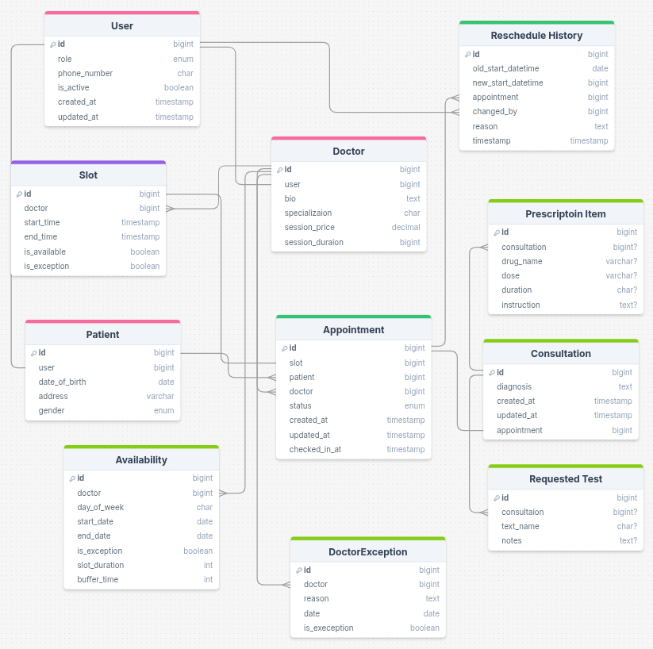

# Django Clinic Appointment System

A comprehensive web-based clinic management system built with Django, designed to streamline appointment scheduling, patient management, medical records, and administrative tasks for healthcare facilities.

## Features

### User Management
- **Role-based Access Control**: Supports four user types - Admin, Doctor, Patient, and Receptionist
- **Custom User Model**: Extended Django user with phone numbers and role-specific profiles
- **Email Verification**: Secure user registration with email verification
- **Profile Management**: Separate profiles for doctors (specialization, bio, session details) and patients (DOB, address, gender)

### Appointment System
- **Slot-based Scheduling**: Doctors can set availability by day of the week with configurable slot durations and buffer times
- **Appointment Lifecycle**: Request → Confirm → Check-in → Complete with status tracking
- **Rescheduling**: Patients can reschedule appointments with history tracking
- **Conflict Prevention**: Prevents double-booking and overlapping appointments

### Medical Records
- **Consultations**: Doctors can create consultation notes linked to appointments
- **Prescriptions**: Manage medication prescriptions with dosage and instructions
- **Test Requests**: Order medical tests with notes

### Dashboard & Analytics
- **Role-specific Dashboards**:
  - **Admin**: System overview, user management, analytics
  - **Patient**: Profile, upcoming appointments, medical history
  - **Doctor**: Daily schedule, patient consultations, notes
  - **Receptionist**: Appointment management, patient check-ins
- **Analytics**: Visual reports and statistics (charts, queues, etc.) -- Admin-only

## Class Diagram


## Installation

### Prerequisites
- Python 3.8+
- PostgreSQL 
- Git

### Setup Steps

1. **Clone the Repository**
   ```bash
   git clone <repository-url>
   cd Django-Clinic-Appointment-System
   ```

2. **Create Virtual Environment**
   ```bash
   python -m venv .venv
   source .venv/bin/activate  # On Windows: .venv\Scripts\activate
   ```

3. **Install Dependencies**
   ```bash
   pip install -r requirements.txt
   ```

4. **Database Setup**
   - For PostgreSQL: Create a database named `clinic_db` and update credentials in `clinic/settings.py`

5. **Run Migrations**
   ```bash
   python manage.py migrate
   ```

6. **Create Superuser**
   ```bash
   python manage.py createsuperuser
   ```

7. **Setup Groups and Permissions**
   ```bash
   python manage.py setup_groups_and_permissions
   ```

8. **Configure Email (Optional)**
   - Update email settings in `clinic/settings.py` for Gmail SMTP or your preferred provider

## Usage

### Running the Development Server
```bash
python manage.py runserver
```
Access the application at `http://localhost:8000`

### User Registration and Login
- Visit the registration page to create accounts
- Email verification required for account activation
- Login with username/email and password

### Role-specific Workflows

#### Admin
- Login with superuser credentials
- View analytics dashboard
- Manage users and permissions

#### Receptionist
- Confirm appointment requests
- Check-in patients
- Manage daily schedules

#### Doctor
- View daily appointments
- Create consultations, prescriptions, and test requests
- Complete appointments

#### Patient
- Book appointments by selecting doctor and available slots
- View medical history and records
- Reschedule or cancel appointments

### Key URLs
- `/` - Home/Dashboard
- `/accounts/login/` - Login
- `/accounts/register/` - Registration
- `/appointments/` - Appointment management
- `/dashboard/` - Role-specific dashboards
- `/medical/` - Medical records

## Project Structure

```
Django-Clinic-Appointment-System/
├── accounts/                 # User management and authentication
│   ├── models.py            # Custom user model, profiles
│   ├── views.py             # Registration, login, profile views
│   ├── templates/           # Auth templates
│   └── management/commands/ # Setup permissions command
├── appointments/            # Appointment booking and management
│   ├── models.py            # Appointment model with status tracking
│   ├── views.py             # Booking, rescheduling views
│   └── templates/           # Appointment templates
├── clinic/                  # Django project settings
│   ├── settings.py          # Configuration
│   ├── urls.py              # Main URL routing
│   └── wsgi.py              # WSGI application
├── dashboard/               # Analytics and role dashboards
│   ├── views/               # Role-specific view modules
│   └── templates/           # Dashboard templates
├── medical/                 # Medical records management
│   ├── models.py            # Consultations, prescriptions, tests
│   ├── views.py             # Medical record views
│   └── templates/           # Medical templates
├── scheduling/              # Doctor scheduling system
│   ├── models.py            # Slots, availability, exceptions
│   ├── views.py             # Scheduling views
│   └── templates/           # Scheduling templates
├── static/                  # CSS, JS, images
├── templates/               # Global templates
├── manage.py                # Django management script
├── requirements.txt         # Python dependencies
└── README.md                # This file
```

## Technologies Used

- **Backend**: Django 4.2.28
- **Database**: PostgreSQL
- **Frontend**: HTML, CSS, JavaScript
- **Email**: Django Email Verification, SMTP
- **Charts**: Chart.js for analytics

